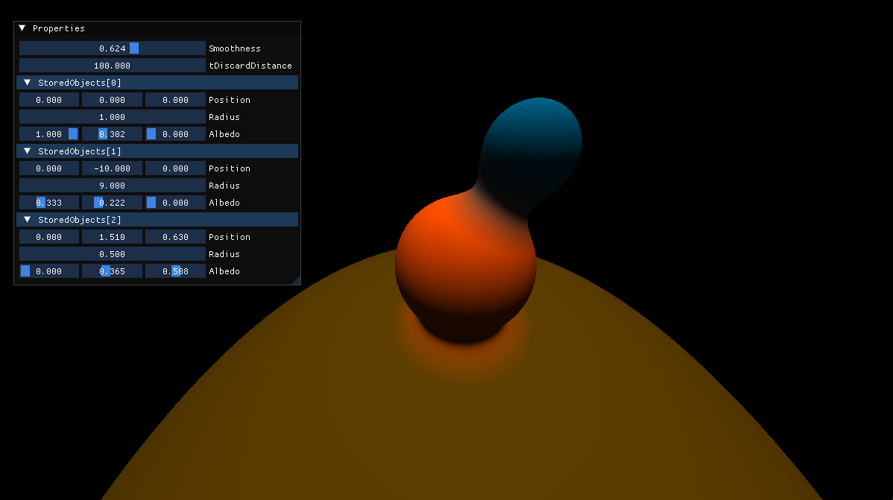

# Raymarcher
Simple raymarcher with SDFs.

## Controls

WASD to move around the Y plane

Space and Ctrl to move up and down

Right click to drag your camera (Euler)

You can edit the object properties in the ImGui window

## Building

### Dynamically-Linked Libraries

Run `buildexe.bat`

### Statically-Linked Libraries

Run `buildexe.bat --static`